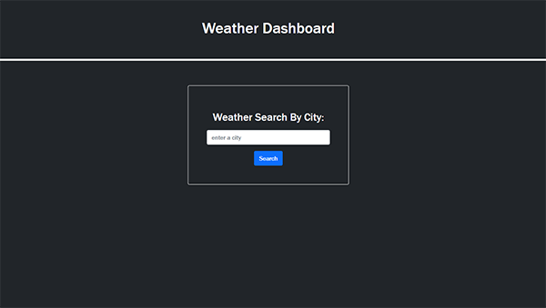
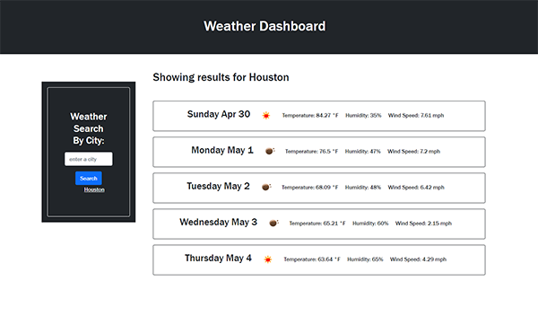

# Is It Raining Outside Weather Dashboard by Kevin Callaghan

## Description

This easy-to-use weather application will provide you a quick 5 day weather forecast with a simple city search.  You can type a city name, hit search, and then view the weather for the next 5 days.  During this project I learned about making API calls, retrieving the data from the response, and then creating elements on the page and appending the data to the html page.

## Table of Contents (Optional)

If your README is long, add a table of contents to make it easy for users to find what they need.

- [Usage](#usage)
- [Credits](#credits)
- [License](#license)

## Usage

Here is a link to the deployed page: https://kevincallaghan.github.io/Is-It-Raining-Outside-Weather-Dashboard/ 

To use the weather tool, simply type in the city you need weather for and hit the submit button.  You will then be presented with the weather forecast and can make an additional search using the form on the right side of the page.

Here is the initial search page:  

Here is the results page:  

    

## Credits

1. Here is the OpenWeatherMap API Documentation I used to make the API's and find current weather by city: https://openweathermap.org/current

2. After getting the lat and lon from the first API, here is the documentation I used for the second API: https://openweathermap.org/forecast5 

3. I used documentation for a different weather API to help with my API.  Here is the documentation I used: https://www.visualcrossing.com/resources/documentation/weather-api/how-to-load-weather-data-in-javascript/ 

4. I used this Stack Overflow article as a reminder on storing and accessing local storage: https://stackoverflow.com/questions/52505323/save-input-value-to-local-storage-and-retrieve-it-on-a-different-page 

## License

Please refer to the LICENSE document in the repository for License Information